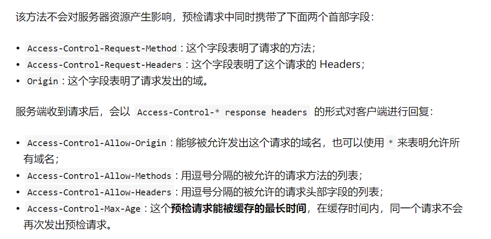
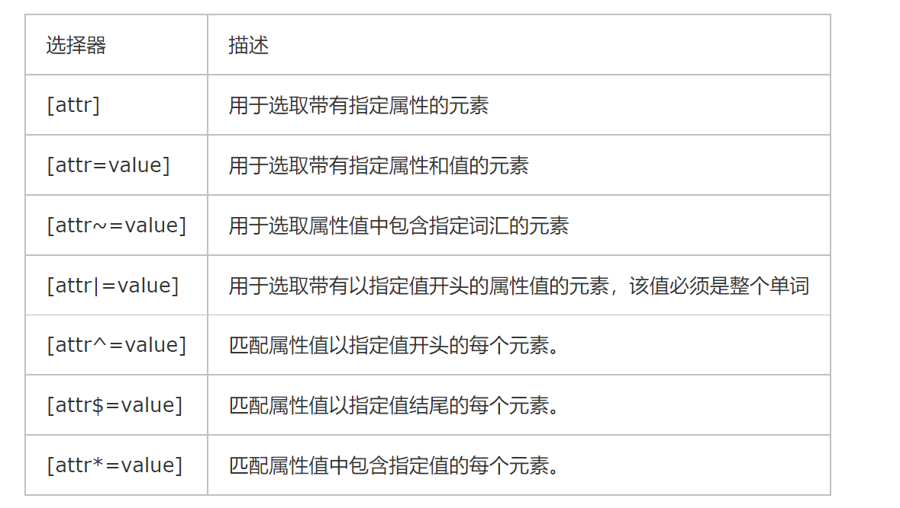
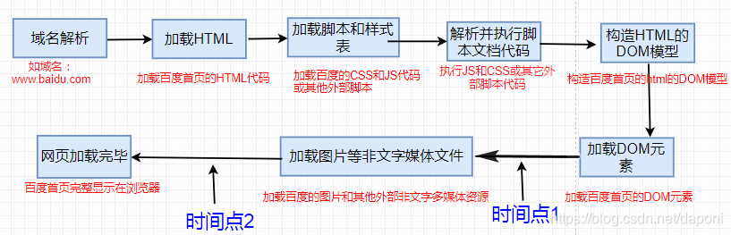
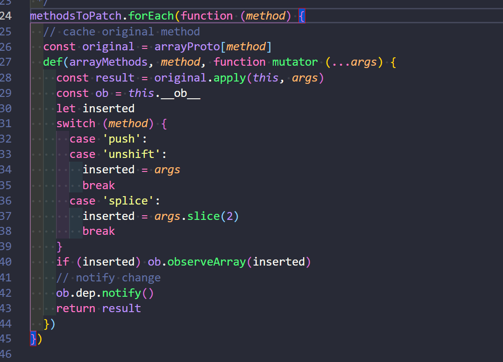
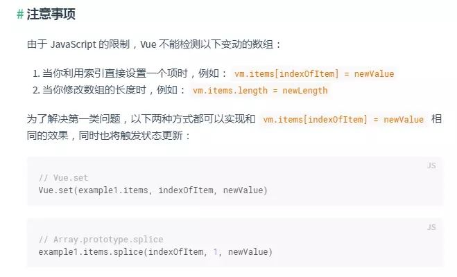
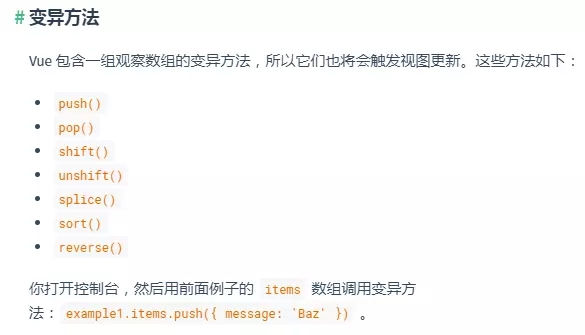
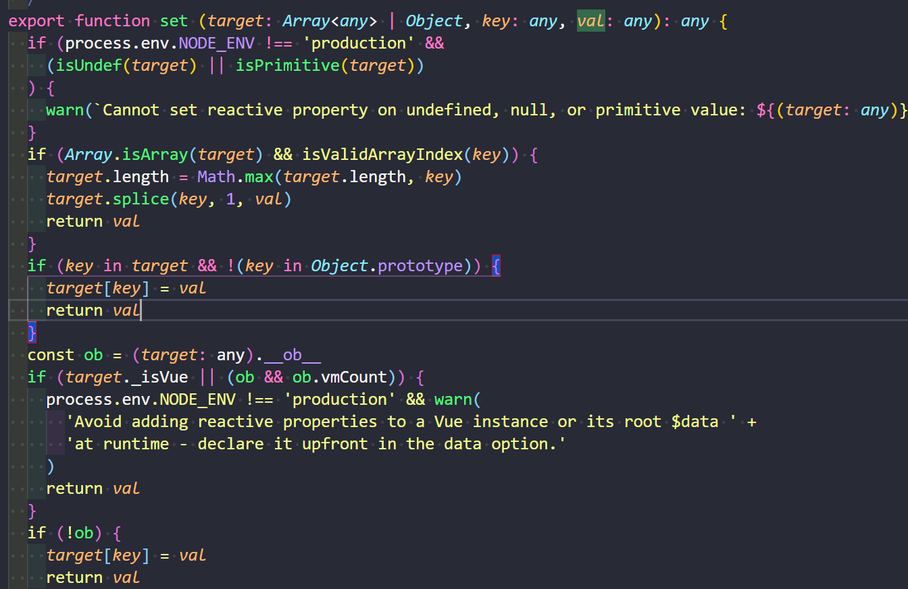

## 为什么浏览器将换行符呈现为空格？

> 看下面的例子  

```html
<span>Hello</span><span>World</span>
```

> 输出:HelloWorld

```html
<span>Hello</span>
<span>World</span>
```

> 输出: Hello World

```html
<style>
  div {
    background-color: pink;
    width: 200px;
    height: 200px;
    display: inline-block;
    vertical-align: middle;
  }
</style>
<div class="div1"></div>
<div class="div2"></div>
<div class="div3"></div>
```


```html
<style>
  div {
    background-color: pink;
    width: 200px;
    height: 200px;
    display: inline-block;
    vertical-align: middle;
  }
</style>
<div class="div1"></div><div class="div2"></div><div class="div3"></div>
```


> 这也就是将块级元素转换为行内块元素时会产生左右间隔的原因。换行符被解释为一个空白字符。


**浏览器在渲染时将多个空白字符（包括换行符）压缩到单个空格。唯一的例外是在`<pre>`元素或具有CSS属性white-space设置pre或pre-wrap设置的元素内。（或者在XHTML中，xml:space="preserve"属性。）**


具体的原因看`W3C`文档：

```text
The document character set includes a wide variety of white space characters. Many of these are typographic elements used in some applications to produce particular visual spacing effects. In HTML, only the following characters are defined as white space characters:

* ASCII space (&#x0020;)
* ASCII tab (&#x0009;)
* ASCII form feed (&#x000C;)
* Zero-width space (&#x200B;)
Line breaks are also white space characters.


文档字符集包括各种各样的空白字符。其中许多是在某些应用程序中用于产生特定视觉间距效果的排版元素。 
在HTML中，只有以下字符被定义为空白字符:
* ASCII space (&#x0020;)
* ASCII tab (&#x0009;)
* ASCII form feed (&#x000C;)
* Zero-width space (&#x200B;)

换行符也是空白字符。
```

## CSS 引入的方式有哪些? link 和@import 的区别是?

> `css`的引入方式:内联、内嵌、外联、导入。

* 内联
```html
<div style="width: 100px;"></div>
```
* 内嵌
```html
<head>
  <style>
    div {
      height: 100px;
      width: 100px;
    }
</style>
</head>
```

* 外联
```html
 <link rel="stylesheet" href="./css/index.css">

```

* 导入
```html
<style>
  @import url(./css/index.css);
</style>
```

推荐使用 **外联** 方式

`@import`和`link`区别:  
* 当一个页面被加载的时候，`link` 引用的 `CSS` 会同时被加载，
而`@import` 引用的 `CSS` 会等到页面全部被加载完再被加载。

* `@import` 可以在 `css `中再次引入
其他样式表，比如可以创建一个主样式表，在主样式表中再引入其他的样式表，如：
```css
main.css
———————-
@import "sub1.css";
@import "sub2.css";
```
这样做有一个缺点，会对网站服务器产生过多的 HTTP 请求，以前是一个文件，而现在却是两个或更多文件了，服务器的压力增大，浏览量大的网站还是谨慎使用。

* `link`是`xhtml`中的标签，所以兼容所有浏览器，但`@import`是在`CSS2.1`提出的，所以低版本的浏览器会不兼容

* `link`可以引入除了`css`以为的其他文件(可以被用来创建站点图标`<link rel="icon" href="favicon.ico">`)，但`@import`只能引入`css`文件。


## CSS 选择符有哪些?哪些属性可以继承?优先级算法如何计算?内联和 important 哪个优先级高?

> `CSS`选择器:

* 1.id选择器（ # myid）
* 2.类选择器（.myclassname）
* 3.标签选择器（div, h1, p）
* 4.相邻选择器（h1 + p）
* 5.子选择器（ul > li）
* 6.后代选择器（li a）
* 7.通配符选择器（ * ）
* 8.属性选择器（a[rel = "external"]）
* 9.伪类选择器（a:hover, li:nth-child）

> 继承
* 可继承的样式： `font-size` `font-family` `color`, `UL` `LI` `DL` `DD` `DT`...
* 不可继承的样式：`border` `padding` `margin` `width` `height`...


> `CSS`选择器优先级问题


>!important 优先级最高

## 布局：两侧固定，中间自适应

### flex 布局

```html
<!DOCTYPE html>
<html lang="en">

<head>
  <meta charset="UTF-8">
  <meta http-equiv="X-UA-Compatible" content="IE=edge">
  <meta name="viewport" content="width=device-width, initial-scale=1.0">
  <title>Document</title>
  <style>
    .wrap {
      height: 300px;
      display: flex;
      flex-flow: row nowrap;
      justify-content: space-between;
    }

    .inner {
      width: 200px;
      background-color: pink;
    }

    .inner2 {
      flex: 1 0 0;
      background-color: deeppink;
    }
  </style>
</head>

<body>
  <div class="wrap">
    <div class="inner inner1"></div>
    <div class="inner inner2"></div>
    <div class="inner inner3"></div>
  </div>
</body>

</html>
```

### 浮动

```html
<!DOCTYPE html>
<html lang="en">

<head>
  <meta charset="UTF-8">
  <meta http-equiv="X-UA-Compatible" content="IE=edge">
  <meta name="viewport" content="width=device-width, initial-scale=1.0">
  <title>Document</title>
  <style>
    .wrap {
      height: 300px;
    }

    .inner {
      width: 200px;
      height: 200px;
      background-color: pink;
    }

    .left {
      float: left;
    }

    .right {
      float: right;
    }

    .inner3 {
      background-color: deeppink;
      margin: 0 200px;
      width: auto;
    }
  </style>
</head>

<body>
  <div class="wrap">
    <div class="inner inner1 left"></div>
    <div class="inner inner2 right"></div>
    <div class="inner inner3"></div>
  </div>
</body>

</html>
```

### 浮动 + BFC

> 利用BFC的特性：BFC的区域不会与浮动盒子产生交集，而是紧贴浮动边缘（可以制作右侧自适应布局）

```html
<!DOCTYPE html>
<html lang="en">

<head>
  <meta charset="UTF-8">
  <meta http-equiv="X-UA-Compatible" content="IE=edge">
  <meta name="viewport" content="width=device-width, initial-scale=1.0">
  <title>Document</title>
  <style>
    .wrap {
      height: 300px;
    }

    .inner {
      width: 200px;
      height: 200px;
      background-color: pink;
    }

    .left {
      float: left;
    }

    .right {
      float: right;
    }

    .inner3 {
      background-color: deeppink;
      width: auto;
      overflow: hidden;
    }
  </style>
</head>

<body>
  <div class="wrap">
    <div class="inner inner1 left"></div>
    <div class="inner inner2 right"></div>
    <div class="inner inner3"></div>
  </div>
</body>

</html>

```

## 4、常见的清除浮动的方法

>1、给父盒子设置高度。但是在前端开发中一般很少指定高度。所以这种方法不适用。

>2、隔墙法:是W3C推荐的做法是通过在浮动元素末尾添加一个空的标签例如 `<div style="clear:both"></div>`或则其他标签br等亦可。(**注意：`clear`属性只对块级元素有效**)

理论上能清除任何标签,但是增加无意义的标签

```html
<style>
  .outer1 .inner {
      width: 100px;
      height: 100px;
      background-color: pink;
      float: left;
  }

  .outer2 {
      width: 200px;
      height: 200px;
      background-color: deeppink;
  }
</style>


<div class="outer1">
  <div class="inner inner1"></div>
  <div class="inner inner2"></div>
  <div class="inner inner3"></div>
  <br class="clear" style="clear: both;" />
</div>
<div class="outer2"></div>
```

>3、父级添加overflow属性方法可以通过触发`BFC`的方式，可以实现清除浮动效果。

>可以给父级添加： overflow为 hidden|auto|scroll  都可以实现。使用 `zoom:1`用于兼容 IE

>4、使用after伪元素清除浮动：

```css
/*  content:"." 里面尽量跟一个小点或空格，或者其他，尽量不要为空，否则在firefox 7.0前的版本会有生成空格。 */
.clearfix::after {
  content: ".";
  display: block;
  clear: both;
  visibility: hidden;
  /* 这两行的目的是让 . 不占据空间 */
  height:0;
  font-size: 0;
}

/* 由于IE6-7不支持::after，使用 zoom:1触发 hasLayout。 */
.clearfix {
  display: block;
  zoom: 1;
  }
 ```

>5、使用before和after双伪元素清除浮动

```css

.clearfix::before,
.clearfix::after {
  /*  content:"." 里面尽量跟一个小点，或者其他，尽量不要为空，否则再firefox 7.0前的版本会有生成空格。 */
  content: ".";
  display: block;
  clear: both;
  visibility: hidden;
  height:0;
}
/* 由于IE6-7不支持::after，使用 zoom:1触发 hasLayout。 */
.clearfix {
  *zoom:1;
}
```

## 5.Vue父子组件生命周期执行顺序

```javascript
// 父组件先创建，然后子组件创建
// 子组件先挂载，然后父组件挂载
父beforeCreate->父created->父beforeMount->子beforeCreate->子created->子beforeMount->子mounted->父mounted

// 更新过程
父beforeUpdate->子beforeUpdate->子updated->父updated

// 销毁过程
父beforeDestroy->子beforeDestroy->子destroyed->父destroyed
```
1. beforeCreate执行时：data和el均未初始化，值为undefined
2. created执行时：Vue 实例观察的数据对象data已经配置好，已经可以得到data的值，但Vue 实例使用的根 DOM 元素el还未初始化
3. beforeMount执行时：data和el均已经初始化，但此时el并没有渲染进数据，el的值为“虚拟”的元素节点
4. mounted执行时：此时el已经渲染完成并挂载到实例上(由 VDMO 变为真实DOM)
5. beforeUpdate和updated触发时，el中的数据都已经渲染完成，但只有updated钩子被调用时候，组件dom才被更新(使用nextTick()函数可以延迟回调到beforeUpdate执行之后执行)
6. 在created钩子中可以对data数据进行操作,这个时候data已经初始化完毕
7. 在mounted中对DOM进行操作，这个时候DOM已经完成渲染
8. **在使用vue-router时有时需要使用来缓存组件状态，这个时候created钩子就不会被重复调用了，如果我们的子组件需要在每次加载或切换状态的时候进行某些操作，可以使用activated钩子触发。**

### 注意

基于上面的理论，在父组件传递接口的数据给子组件时，一定要在子组件标签上加上v-if="传递的接口数据"

比如下面的例子:

```javascript
<div class="test">
    <children :data="data1" ></children>
</div>

// ...
created() {
    // 通过axios异步获取data1，这个时候就不能在子组件中使用data1了，因为不能确定data1什么时候会有数据
}
```

#### 方案一

```javascript
// 这样就会形成天然的阻塞。在父组件的created中的请求返回数据后，才会执行子组件的created，mounted。最后执行父组件的mounted
<div class="test">
    <children v-if="data1" :data="data1" ></children>
</div>
```

#### 方案二

```javascript
<div class="test">
    <children :data="data1" ></children>
</div>

... 子组件
// 等到 data1 有数据的时候才渲染div
<div v-if='data1'></div>
```

#### 方案三

```javascript
watch:{
    data:{
      deep:true,
      handler:function(newVal,oldVal) {
        this.$nextTick(() => {
          this.data = newVal
          this.data = newVal.url ? newVal.url : ''
        })
      }
    },
}
```

> 如果父组件的数据是通过`axios`异步获取的话，那么这个时候即使子组件执行到了`mounted`钩子函数，还是获取不到数据的。这个时候就得使用上面提到的三种方法之一。

### 单一组件钩子执行顺序（activated, deactivated 是组件keep-alive时独有的钩子）

```javascript
beforeCreate
created
beforeMount
mounted
beforeUpdate
updated
activated
deactivated
beforeDestroy
destroyed
errorCaptured
```

## Vue的计算属性

`computed`属性是`Vue.js`的计算属性，只有在**某个属性依赖一些其他的属性，而且需要做大量的运算的时候才会使用，主要是使用计算属性的缓存机制**

注意以下几点：  
1. 默认只提供`get`访问器，`set`访问器需要自己定义；
2. `get`只会在依赖值发生变化的时候才会触发(**而且必须将计算属性渲染到模板上去才行，不然即使依赖发生了变化也不会触发get**)
3. `set`只有在计算属性本身直接发生变化的时候才触发。

## Vue组件间通信(6种)

### props和$emit实现父子组件通信

#### 父传子(属性绑定props)

```javascript
<body>
  <div id="app">
    <h1>我是父组件</h1>
    <!-- 使用子组件 -->
    <child-component :users="users"></child-component>
  </div>
</body>
<script>
  // 创建 Vue 组件
  const childComponent = {
    template: `
    <div class="hello">
      <h1>我是子组组件</h1>
      <ul>
        <li v-for="(item, index) in users" :key="index">{{item}}</li>
      </ul>
    </div>
    `,
    // 定义需要从父组件接受的值的名称
    props: {
      users: {
        type: Array,
        required: true,
      }
    }
  }

  // 创建 Vue 实例
  const vm = new Vue({
    el: '#app',
    data: {
      msg: '父组件数据',
      users: [
        "Henry",
        "Bucky",
        "Emily",
      ]
    },
    // 挂载子组件
    components: {
      childComponent,
    },
  });

</script>
```
**总结：父组件通过props向下传递数据给子组件。注：组件中的数据共有三种形式：data、props、computed**

#### 子传父

```javascript
<body>
  <div id="app">
    <h1>我是父组件</h1>
    <p>子组件值为：{{childData}}</p>
    <!-- 使用子组件 -->
    <child-component @data-changed="getDataFromChild"></child-component>
  </div>
</body>
<script>
  // 创建 Vue 组件
  const childComponent = {
    template: `
    <div class="hello">
      <h1>我是子组组件</h1>
      <button @click="changeFather()">传值给父组件</button>
    </div>
    `,
    data() {
      return {
        msg: '子组件'
      }
    },
    methods: {
      changeFather() {
        // 触发父组件在自己身上注册的事件
        this.$emit('data-changed', this.msg);
      }
    }
  }

  // 创建 Vue 实例
  const vm = new Vue({
    el: '#app',
    data: {
      msg: '父组件',
      childData: ''
    },
    // 挂载子组件
    components: {
      childComponent,
    },
    methods: {
      // 该回调会在子组件中执行
      getDataFromChild(data) {
        console.log('xxx')
        this.childData = data;
      }
    }
  });
</script>
```

**总结：子组件通过events给父组件发送消息，实际上就是子组件把自己的数据发送到父组件**


### 通过$emit/$on实现非父子组件传值

这种方法通过一个`空的Vue实例`作为中央事件总线（`事件中心`），用它来触发事件和监听事件,巧妙而轻量地实现了任何组件间的通信，包括父子、兄弟、跨级

> 原理： $on 是给vue实例注册事件；$emit触发vue实例上定义的事件

```javascript
<body>
  <div id="app1">
    <span>组件A</span>
    <button @click="send">将数据发送给B组件</button>
    <span>收到来自组件C的数据：{{dataFromC}}</span>
  </div>
  <div id="app2">
    <span>组件B</span>
    <button @click="send">将数据发送给C组件</button>
    <span>收到来自组件A的数据：{{dataFromA}}</span>
  </div>
  <div id="app3">
    <span>组件C</span>
    <button @click="send">将数据发送给A组件</button>
    <span>收到来自组件B的数据：{{dataFromB}}</span>
  </div>
</body>
<script>
  // 创建一个空的Vue实例作为事件中心
  const eventVM = new Vue();
  // 创建 Vue 实例
  const vm = new Vue({
    el: '#app1',
    data: {
      msg: '我是组件A的值',
      dataFromC: '',
    },
    methods: {
      send() {
        // 触发事件
        eventVM.$emit('getDataFromA', this.msg);
      }
    },
    // 挂载组件的时候注册对应是事件
    mounted() {
      eventVM.$on('getDataFromC', (data) => {
        // 获取触发了 getDataFromC 事件的组件传递过来的值
        this.dataFromC = data;
      });
    },
  });
  const vm2 = new Vue({
    el: '#app2',
    data: {
      msg: '我是组件B的值',
      dataFromA: '',
    },
    methods: {
      send() {
        eventVM.$emit('getDataFromB', this.msg);
      }
    },
    // 挂载组件的时候注册对应是事件
    mounted() {
      eventVM.$on('getDataFromA', (data) => {
        // 获取触发了 getDataFromA 事件的组件传递过来的值
        this.dataFromA = data;
      });
    },
  });
  const vm3 = new Vue({
    el: '#app3',
    data: {
      msg: '我是组件C的值',
      dataFromB: '',
    },
    methods: {
      send() {
        eventVM.$emit('getDataFromC', this.msg);
      }
    },
    // 挂载组件的时候注册对应是事件
    mounted() {
      eventVM.$on('getDataFromB', (data) => {
        // 获取触发了 getDataFromB 事件的组件传递过来的值
        this.dataFromB = data;
      });
    },
  });
</script>
```
### $attrs/$listeners

> $attrs：包含了父作用域中不被 prop 所识别 (且获取) 的特性绑定 (class 和 style 除外)。当一个组件没有声明任何 prop 时，这里会包含所有父作用域的绑定 (class 和 style 除外)，并且可以通过 v-bind="$attrs" 传入内部组件。通常配合 interitAttrs 选项一起使用。  

> $listeners：包含了父作用域中的 (不含 .native 修饰器的) v-on 事件监听器。它可以通过 v-on="$listeners" 传入内部组件

```javascript
<body>
  <template id="tem1">
    <div>
      <p>childCom1的$attrs: {{ $attrs }}</p>
      <button @click="dataToParent">传值给父组件</button>
      <component-b v-bind="$attrs" v-on="$listeners"></component-b>
    </div>
  </template>
  <template id="tem2">
    <div>
      <p>childCom2: {{ $attrs }}</p>
      <button @click="dataToParent">传值给父组件</button>
    </div>
  </template>
  <div id="app">
    <h1>子组件传递过来的值：{{dataChild}}</h1>
    <component-a :foo="foo" :boo="boo" :coo="coo" :doo="doo" @get-data="getDataFromChild">
      <component-b></component-b>
    </component-a>
  </div>
</body>
<script>

  // 定义组件对象
  const componentB = {
    template: '#tem2',
    data() {
      return {
        msg: 'componentB'
      }
    },
    // 子组件定义 props 属性
    props: ['foo'],
    // 可以关闭自动挂载到组件根元素上的没有在props声明的属性
    inheritAttrs: false,
    methods: {
      dataToParent() {
        this.$emit('get-data', this.msg);
      }
    },
  }

  const componentA = {
    template: '#tem1',
    data() {
      return {
        msg: 'componentA'
      }
    },
    // 子组件不定义 props 属性
    // 可以关闭自动挂载到组件根元素上的没有在props声明的属性
    inheritAttrs: false,
    methods: {
      dataToParent() {
        // 触发 get-data 事件
        this.$emit('get-data', this.msg);
      }
    },
    components: {
      componentB,
    }
  }

  const vm = new Vue({
    el: '#app',
    data: {
      foo: "Javascript", boo: "Html", coo: "CSS", doo: "Vue", dataChild: '',
    },
    components: {
      componentA,
      componentB,
    },
    methods: {
      getDataFromChild(data) {
        console.log(data);
        this.dataChild = data;
      }
    },
  });
</script>
```

### provide/inject

这两个选项是`Vue 2.2.0`新增的，需要一起使用，**以允许一个祖先组件向其所有子孙后代注入一个依赖，不论组件层次有多深，并在起上下游关系成立的时间里始终生效。**

简单来说，就是祖先组件中通过`provider`来提供变量，然后在子孙组件中通过`inject`来注入变量。

```javascript
// 父组件
export default {
  provide() {
    return {
      name: '浪里行舟'
    }
  }
}


// 子组件
export default {
  inject: ['name'],
  mounted () {
    console.log(this.name);  // 浪里行舟
  }
}
```

> 注意：这种方式下数据不会是响应式的。也就是说父组件的name字段修改了，但是子组件的值不会自动同步（当然，不过传递的是引用值，那是会改变的。不过这不能算是数据响应式）**只有传入一个响应式对象才行。在Vue中可以使用 Vue.observable( object ) 来创建一个响应式对象**

#### provide与inject 怎么实现数据响应式

1. 父组件在`provide`中将自己的实例`this`传递过去，那么在子组件中就可以响应式修改了。不过这样会导致传递了父组件中很多无用的属性；

2. 使用2.6最新API `Vue.observable` 优化响应式 provide(推荐)

##### 第一种

```html
<body>
  <div id="app">
    <p>父组件数据：{{msg}}</p>
    <button @click="changeData">修改msg</button>
    <component-a></component-a>
  </div>
</body>
<script>
  // 创建子组件
  const componentB = {
    template: '<div><span>我是组件B，父组件传递过来的值为：{{msg.msg}}</span></div>',
    // 通过 inject 依赖注入父组件的值
    inject: ['msg'],
  }
  // 创建子组件
  const componentA = {
    template: '<div><span>我是组件A，父组件传递过来的值为：{{msg.msg}}</span><component-b></component-b></div>',
    // 通过 inject 依赖注入父组件的值
    inject: ['msg'],
    components: {
      'component-b': componentB,
    },
  }

  // 根组件
  const vm = new Vue({
    el: '#app',
    data: {
      msg: '父组件'
    },
    components: {
      'component-a': componentA,
    },
    provide() {
      return {
        msg: this,
      }
    },
    methods: {
      changeData() {
        this.msg = 'data1';
      }
    },
  });

</script>
```

##### 第二种

```html
<body>
  <div id="app">
    <p>父组件数据：{{msg}}</p>
    <button @click="changeData">修改msg</button>
    <component-a></component-a>
  </div>
</body>
<script>
  // 创建子组件
  const componentB = {
    template: '<div><span>我是组件B，父组件传递过来的值为：{{msg.msg}}</span></div>',
    // 通过 inject 依赖注入父组件的值
    inject: ['msg'],
  }
  // 创建子组件
  const componentA = {
    template: '<div><span>我是组件A，父组件传递过来的值为：{{msg.msg}}</span><component-b></component-b></div>',
    // 通过 inject 依赖注入父组件的值
    inject: ['msg'],
    components: {
      'component-b': componentB,
    },
  }

  // 根组件
  const vm = new Vue({
    el: '#app',
    data: {
      msg: '父组件'
    },
    components: {
      'component-a': componentA,
    },
    provide() {
    // Vue.observable：让一个对象可响应。Vue 内部会用它来处理 data 函数返回的对象
      this.injectData = Vue.observable({
        msg: this.msg,
      });
      return {
        msg: this.injectData
      }
    },
    methods: {
      changeData() {
        this.msg = 'data1';
        this.injectData.msg = this.msg;
      }
    },
  });

</script>
```

### $parent / $children与 ref

* ref：如果在普通的 DOM 元素上使用，引用指向的就是 DOM 元素；如果用在子组件上，引用就指向组件实例  
* $parent / $children：访问父 / 子实例

> 缺点： 只能在父子组件之间使用(嵌套很深的时候很不方便)

```html
<body>
  <div id="app">
    <p>父组件数据：{{msg}}</p>
    <button @click="changeData">修改msg</button>
    <component-a></component-a>
  </div>
</body>
<script>
  // 创建子组件
  const componentB = {
    template: '<div><span>我是组件B，父组件传递过来的值为：{{this.$parent.$parent.msg}}</span></div>',
  }
  // 创建子组件
  const componentA = {
    template: '<div><span>我是组件A，父组件传递过来的值为：{{this.$parent.msg}}</span><component-b></component-b></div>',
    components: {
      'component-b': componentB,
    },
  }

  // 根组件
  const vm = new Vue({
    el: '#app',
    data: {
      msg: '父组件'
    },
    components: {
      'component-a': componentA,
    },
    methods: {
      changeData() {
        this.msg = 'data1';
      }
    },
  });

</script>
```


## vue的propsData

`propsData`一般配合全局扩展`Vue.extend()`使用：  
可以给全局扩展赋初值
```html
<!DOCTYPE html>
<html>

<head>
  <meta charset="utf-8">
  <title>propsData属性</title>
  <script src="https://cdn.jsdelivr.net/npm/vue@2.6.12/dist/vue.js"></script>
</head>

<body>
  <header></header>
  <script type="text/javascript">
    var demo = Vue.extend({
      template: `<p style="color:red">这是利用propsData传递数据-----{{demo}}---{{a}}</p>`,
      data: function () {
        return {
          demo: '这里采用了插值的方式'
        }
      },
      props: ['a']
    });
    new demo({
      // 动态传递一些值
      propsData: {
        a: 'propsData设置值'
      }
    }).$mount('header')
  </script>
</body>

</html>

````

## Vue.js 事件修饰符

1. .stop    阻止冒泡
2. .prevent    阻止默认行为
3. .capture     使用事件捕获机制
4. .self        只有在点击到自己才会触发
5. .once        点击之后值会触发一次
6. .passive     passive这个修饰符会执行默认方法

### .passive

首先必须清楚一个点：`js`什么时候才知道要阻止事件的默认行为？

> 浏览器只有等内核线程执行到事件监听器对应的JavaScript代码时，才能知道内部是否会调用preventDefault函数来阻止事件的默认行为，所以浏览器本身是没有办法对这种场景进行优化的。

> 这里一般用在滚动监听，@scoll，@touchmove 。因为滚动监听过程中，移动每个像素都会产生一次事件，每次都使用内核线程查询prevent会使滑动卡顿。我们通过passive将内核线程查询跳过，可以大大提升滑动的流畅度

### .native

```javascript
<父组件>
    // 不会触发，该事件会注册给子组件，只能在子组件中通过$emit触发
    <子组件 @click="getMsg()"></子组件>
    // 加上 native 才行
    <子组件 @click.native="getMsg()"></子组件>
</父组件>


父组件:
  methods: {
      getMsg() {
          
      }
  }
```

## js阻止冒泡和默认行为

### 阻止冒泡

`event.stopPropagation()`(不能阻止默认行为)

`e.cancelBubble = true`(IE浏览器)

`return false`(阻止冒泡和默认行为)

### 阻止默认行为

`event.preventDefault()`(不能阻止冒泡)

`e.returnValue = false`(IE浏览器)

`return false`(阻止冒泡和默认行为)

## HTTP常见的状态响应码

1XX：接受的请求正在处理

2XX：请求正常处理完毕

3XX：需要进行附加操作以完成请求

4XX：客户端请求资源错误

5XX：服务器错误

301：永久性重定向。请求的资源已经被分配了新的URI，之后使用新的新的URI进行请求（如果已经对请求的资源进行了书签保存，那么应该更新书签为新的URI）

302：临时重定向。请求的资源已经被分配了新的URI，但是只是临时的，未来可能还会改变。不用修改书签。

303：请求的资源存在另一个URI，应该再发一次GET请求---和302不同，303明确要求使用GET方式。

**上面的请求几乎都会将POST转为GET，并按照新的URI再发一次请求**

304：Not Modified：服务器允许请求访问的资源，不过客户端携带的条件不满足（If-Modified-Sinc、If-None-Match...）,客户端可以直接使用未过期的缓存资源。不会包含任何响应主体部分。

307：临时重定向。和302不同在于不会讲POST转为GET

400：请求报文存在语法错误
401：发送的请求需要HTTP认证
403：请求的资源不允许被访问
404：资源路径错误

500：服务器错误
503：服务器目前处于超负载或者维修状态

## js遍历数组方法  

1. `for循环`

2. `for-in`  
  in代表数组下标。建议用它遍历对象，不要遍历数组。

3. `for-of`

4. `forEach`
    对数组的每个元素都会执行对应的回调
    
5. `some`
    从第一个元素开始执行回调，如果有一个回调返回true，那么后续的元素就不再执行回调了。（单纯遍历的话，可以不要返回值）
    
6. `every`
    与some相对，有一个回调返回false，那么后面的就不执行
    
7. `filter`
    创建一个新的数组，新数组中的元素是通过检查指定数组中符合条件的所有元素
   
8. `map`
    返回一个新数组，数组中的元素为原始数组元素调用函数处理后的值
    

## js数组增删改查常用方法

### 插入

1. `push`：把它们逐个添加至数组末尾

2. `unshift`：把它们逐个添加至数组头部

3. `concat`：数组连接

4. `splice`：任意位置插入元素

### 删除

1. `pop`：删除末尾元素

2. `shift`：删除头部元素

3. `slice`：截取指定的元素

4. `splice`---既能删除又能添加

### 改动

1. `splice`

### 查找

1. `indexOf()`---开头开始找
2. `lastIndexOf()`---结束开始找

## js判断数据类型

### typeof

`typeof` 返回一个表示数据类型的字符串，返回结果包括：number、boolean、string、object、undefined、function、symbol等7种数据类型。    
而对于引用类型返回的基本上都是object, 其实返回object也没有错，因为所有对象的原型链最终都指向了Object,Object是所有对象的`祖宗`。 如果判断的是引用类型的话，typeof 就显得有些力不从心了。  
**typeof null 返回值为 object**

> typeof返回的值: `string、number、boolean、symbol、function、object、undefined`

### instanceof(只能判断对象类型)

instanceof 是用来判断 A 是否为 B 的实例对，表达式为：A instanceof B，如果A是B的实例，则返回true,否则返回false。 在这里需要特别注意的是：instanceof检测的是原型  
本质：**A.\_\_proto\_\_ == B.prototype**

### Object.prototype.toString .call

```javascript
Object.prototype.toString.call('') ;   // [object String]
Object.prototype.toString.call(1) ;    // [object Number]
Object.prototype.toString.call(true) ; // [object Boolean]
Object.prototype.toString.call(undefined) ; // [object Undefined]
Object.prototype.toString.call(null) ; // [object Null]
Object.prototype.toString.call(new Function()) ; // [object Function]
Object.prototype.toString.call(new Date()) ; // [object Date]
Object.prototype.toString.call([]) ; // [object Array]
Object.prototype.toString.call(new RegExp()) ; // [object RegExp]
Object.prototype.toString.call(new Error()) ; // [object Error]
```

## js判断对象是否相等

### JSON.stringify()

将对象转为字符串。这样不是很严谨，如果一个对象里是有两个属性的，只是位置不一样而已，这样的方法就是错误的。

### 遍历对象属性

使用`Object.getOwnPropertyNames`拿到对象的属性（可枚举加不可枚举），然后判断两个对象所有的属性，对于属性值是对象的话，就使用递归。

```js
function objectEqual(target, source) {
  if (typeof target !== 'object' && typeof source !== 'object') return false
  // 传入的是 null, null
  if (!target && !source) return true
  // 获取对象自身的全部属性
  const targetProps = Object.getOwnPropertyNames(target)
  const sourceProps = Object.getOwnPropertyNames(source)
  if (targetProps.length !== sourceProps.length) return false
  for (const key of targetProps) {
    // 递归
    if (typeof target[key] === 'object' && typeof source[key] === 'object') {
      if (!arguments.callee(target[key], source[key])) {
        return false
      } else {
        continue
      }
    }
    if (!Object.is(target[key], source[key])) return false
  }
  return true
}
```


> 下面看看 `vue.js`源码里面的写法

```js
function isObject(obj) {
  return obj !== null && typeof obj === 'object'
}

function looseEqual(target, source) {
  if (target === source) return true
  const _args = arguments
  // if (typeof target !== 'object' && typeof source !== 'object') return false
  const isObjectTarget = isObject(target)
  const isObjectSource = isObject(source)
  if (isObjectTarget && isObjectSource) {
    try {
      const isArrayTarget = Array.isArray(target)
      const isArraySource = Array.isArray(source)
      if (isArrayTarget && isArraySource) {
        return target.length === source.length && target.every((item, index) => {
          return _args.callee(item, source[index])
        })
      } else if (target instanceof Date && source instanceof Date) {
        return target.getTime() === source.getTime()
      } else if (!isArrayTarget && !isArraySource) {
        const targetProps = Object.getOwnPropertyNames(target)
        const sourceProps = Object.getOwnPropertyNames(source)
        return targetProps.length === sourceProps.length && targetProps.every((key) => {
          return _args.callee(target[key], source[key])
        })
      } else {
        return false
      }
    } catch (e) {
      return false
    }
  } else if (!isObjectTarget && !isObjectSource) {
    return String(target) === String(source)
  } else {
    return false
  }
}
```

## js拷贝一个对象

### 浅拷贝

#### 使用 Object.assign()

```javascript
// 将 src 对象和 {} 进行合并
// 完成对 src 的拷贝
const des = Object.assign({}, src);
```

#### 使用对象扩展运算符
```javascript
const des = {...src}
```

#### 自己编写函数完成
```javascript
function extendCopy(p) {
  var c = {};
  for (var i in p) {
    c[i] = p[i];
  }
  c.uber = p;
  return c;
}
```


#### 上面两种方式实现对原型的拷贝

```javascript
// 写法一
//* 注意 __proto__是浏览器环境提供的
const clone1 = {
  __proto__: Object.getPrototypeOf(obj),
  ...obj,
};

// 写法二
const clone2 = Object.assign(
  // 创建一个空对象，该对象的原型指向 obj 的原型对象
  Object.create(Object.getPrototypeOf(obj)),
  // 完成对对象自身属性的拷贝
  obj,
);

// 写法三
const clone3 = Object.create(
  // 指定新创建对象的原型
  Object.getPrototypeOf(obj),
  // 完成初始属性的复制
  Object.getOwnPropertyDescriptors(obj),
);

```

### 深拷贝

#### 递归

```javascript
function deepCopy(p, c) {
  var c = c || {};
  for (var i in p) {
    if (typeof p[i] === 'object') {
      c[i] = (p[i].constructor === Array) ? [] : {};
      deepCopy(p[i], c[i]);
    } else {
      c[i] = p[i];
    }
  }
  return c;
}

// 调用
const Doctor = deepCopy(Chinese);
```
#### lodash.cloneDeep()实现深拷贝

```javascript
let _ = require('lodash');
let obj1 = {
    a: 1,
    b: { f: { g: 1 } },
    c: [1, 2, 3]
};
let obj2 = _.cloneDeep(obj1);
```

#### JSON.stringify 和 JSON.parse

用 JSON.stringify 把对象转换成字符串，再用 JSON.parse 把字符串转换成新的对象。

```javascript
//通过js的内置对象JSON来进行数组对象的深拷贝
function deepClone(obj) {
  let _obj = JSON.stringify(obj);
  let objClone = JSON.parse(_obj);
  return objClone;
}
```

**可以转成 JSON 格式的对象才能使用这种方法，如果对象中包含 function 或 RegExp 和 undefined 这些就不能用这种方法了**

## 判定变量是否相等

### 使用 == 

`==`只能判断变量的值是否相等，不能判断类型。

### 使用 ===

`===`会先比较两个变量的类型是否一致，一致的话再比较值。

前面两种都有一些情况比较不了，比如:

```javascript
// 取决于具体的 js 引擎
console.log(+0 === -0)
console.log(+0 === 0)
console.log(-0 === 0)
```

### 使用ES6新增的Object.is()

```javascript
console.log(Object.is(null, undefined));    // false
console.log(Object.is(-0, 0));  // false 
```

## NAN

`JavaScript`中，`NaN`是一个特殊的数字值（typeof NaN的结果为number），是`not a number`的缩写，表示不是一个合法的数字

**NAN是唯一和自身不相等的元素**；

```javascript
// false
console.log(NaN === NaN)
```

### 如何辨别NaN

#### 使用isNaN()

可以使用全局函数`isNaN()`来判断一个数值是不是一个非数字

```javascript
isNaN(NaN)  // true
isNaN(10)  // false
```

#### 使用ES6新增的Object.is()

```javascript
console.log(Object.is(NaN, NaN));    // true
```

## null 和 undefined 区别

1. `null`表示无，在转为数值的时候为`0`;`undefined`转为数值的时候为`NaN`；
2. 变量申明但是没有赋值，变量的值为`undefined`
3. 调用函数未传参，值为`undefined`
4. 函数没有返回值时，默认返回`undefined`
5. 用 `==` 判断，两者相等；`===` 判断则不相等

## delete 和 将值变为undefined区别

在`js`中，删除某个对象的属性应该使用`delete`，该操作符在成功删除之后会返回`true`，删除失败会返回`false`。

而将对象的某个属性设置为`undefined`的时候，该属性还是存在的，只不过值为`undefined`

```javascript
// [ 'age', 'name' ]
console.log(Object.getOwnPropertyNames(obj));
obj.name = undefined;
// [ 'age', 'name' ]
console.log(Object.getOwnPropertyNames(obj));

delete obj.name;
// [ 'age' ]
console.log(Object.getOwnPropertyNames(obj));
```

`delete`删除数组元素的时候，会将数组连同其下标一起删除，但是数组长度不会变（**使用Vue.delete()能够将数组元素彻底删除**）

```javascript
var arr1 = [1, 2, 3, 4, 5];
delete arr1[2];
// [ 1, 2, <1 empty item>, 4, 5 ]
console.log(arr1);
// 5
console.log(arr1.length);
// 1 2 undefined 4 5
for (let i = 0; i < arr1.length; i++) {
  console.log(arr1[i])
}

/*
0 --- 1
1 --- 2
3 --- 4
4 --- 5 */
arr1.forEach((item, index) => {
  console.log(index, '---', item);
});
```

## 判断对象的属性是否有值

1. `Object.prpName === undefined`

2. 使用`in`操作符

```javascript
alert( "test" in obj ); // true，属性存在！
```

## var注意事项  

`ES6`之前，`javascript`只能使用`var`定义变量。但是`var`定义的变量有一个问题：**变量提升**。

> var 定义变量会提升，但是初始化变量不会提升：

```javascript
console.log(c)  // undefined
var c = 1;
console.log(c)  // 1

// 对变量 c 的定义会提升
// 相当于
// 会将变量的定义提升，但是赋的初值不会提升
var c;
console.log(c)
c = 1;
console.log(c)
```

## js引擎

## Object.create()

`Object.create(proto，[propertiesObject])`

参数一：指定创建的对象的原型对象

参数二：给指定的对象创建一些属性（相当于Object.defineProperties()的第二个参数）

返回值：一个新对象，带着指定的原型对象和属性。

```javascript
const person = {
  isHuman: false,
  printIntroduction: function() {
    console.log(`My name is ${this.name}. Am I human? ${this.isHuman}`);
  }
};

// 对象实例 me 的原型对象是 Person(就是说 me.__proto__ == person)
const me = Object.create(person);

// name 属性添加给 me 实例，不会添加给person对象
me.name = 'Matthew'; 
// 在对象实例身上重写了其原型的 isHuman 属性，会覆盖原型对象的 isHuman 属性
me.isHuman = true; 

// 输出："My name is Matthew. Am I human? true"
me.printIntroduction();
```

```javascript
var o;
// 创建一个原型为null的空对象
o = Object.create(null);

o = {};
// 以字面量方式创建的空对象就相当于:
o = Object.create(Object.prototype);

o = Object.create(Object.prototype, {
  // foo会成为所创建对象的数据属性
  foo: {
    writable:true,
    configurable:true,
    value: "hello"
  },
  // bar会成为所创建对象的访问器属性
  bar: {
    configurable: false,
    get: function() { return 10 },
    set: function(value) {
      console.log("Setting `o.bar` to", value);
    }
  }
});


function Constructor(){}
o = new Constructor();
// 上面的一句就相当于:
o = Object.create(Constructor.prototype);
// 当然,如果在Constructor函数中有一些初始化代码,Object.create不能执行那些代码


// 创建一个以另一个空对象为原型,且拥有一个属性p的对象
o = Object.create({}, { p: { value: 42 } })

// 省略了的属性特性默认为false,所以属性p是不可写,不可枚举,不可配置的:
o.p = 24
o.p
//42

o.q = 12
for (var prop in o) {
   console.log(prop)
}
//"q"

delete o.p
//false

//创建一个可写的,可枚举的,可配置的属性p
o2 = Object.create({}, {
  p: {
    value: 42,
    writable: true,
    enumerable: true,
    configurable: true
  }
});
```

## Object.keys()

## js基本数据类型和引用类型

### 基本类型

`Undefined、Null、Boolean、Number、String、Symbol`

1. 基本类型的访问是按值访问的，就是说你可以操作保存在变量中的实际的值

2. 我们不能给基本类型添加属性和方法

3. 基本类型的变量是存放在栈区的（栈区指内存里的栈内存），栈区包括了 变量的标识符和变量的值

### 引用类型

`Object(Array、Object、Array、RegExp、Date、Function)`

1. 引用类型的值是按引用访问的。

2. 引用类型可以拥有属性和方法，并且是可以动态改变的。

3. 引用类型的存储需要内存的栈区和堆区（堆区是指内存里的堆内存）共同完成，栈区内存保存 变量标识符 和 指向堆内存中该对象的指针

## js函数中的call()、bind()、call()

这三个方法都是函数对象原型上的方法，主要用途是改变函数调用时函数内部的`this`指向问题。同时也会给要调用的函数传递参数。


## 自定义 bind() 函数

`bind()`函数本质上还是调用的`apply()`方法。只不过需要我们自己将参数组合起来:

```javascript
// 自定义 bind() 方法
Function.prototype._my_bind = function () {
  // 获取原始函数
  const _function = this
  const _args = arguments
  return function () {
    return Function.prototype.call.apply(_function, [..._args, ...arguments])
  }
}

function test(a, b) {
  console.log(this.name, a, b);
}

let obj = {
  name: 'jack',
}

// jack 1 2
test._my_bind(obj, 1)(2);
```

## 常见的HTTP请求和响应行

## js考察闭包笔试题

```javascript
function Foo() {
    var i = 0;
    return function() {
        console.log(i++);
    }
}
 
// js在每次调用函数的时候都会为函数创建一个函数执行上下文。然后创建作用域链。作用域链指向函数的活动对象
var f1 = Foo(),
    f2 = Foo();
f1();
// 第二次调用 f1() 的时候还是使用的之前的活动对象
f1();
// f2 指向一个新的活动对象
f2();

// 0 1 0
```

## js考察函数定义提升笔试题

```javascript
var foo=function(x,y){
return x-y;
}
function foo(x,y){
return x+y;
}
// -1
var num=foo(1,2);
```

js引擎对函数的定义会提升，但是函数表达式是不会提升的:

```javascript
// 提升
function foo(x,y){
return x+y;
}

// 覆盖上面的定义
var foo=function(x,y){
return x-y;
}

// -1
var num=foo(1,2);
```

## 地址栏输入url按回车发生了什么

以`http://www.jianshu.com/`为例：

上面的`url`包含四个部分:
* 协议：http
* 域名(服务器地址)：www.jianshu.com
* 端口号：http协议默认是80端口，https协议默认是443端口。https就是加密的http协议，就是在http和TCP之间加了一层TSL或者SSL的安全层
* 资源位置：默认是`index.html`

1. `DNS`域名解析系统解析域名返回对应的`IP`地址
2. `http`协议负责生成对目标服务器的`http请求报文`
3. `tcp/ip`协议将报文分割成报文段，并通过三次握手尝试建立连接（ip协议搜索对方地址进行中转）
4. 服务器接收到请求报文处理后返回响应报文（过程和上面一样）
5. 服务器返回html文档之后，浏览器的渲染引擎开始dom解析过程（`构建DOM树->渲染树（Render tree）->布局render树->绘制render树`）

最后一步：  
5.1 调用`html解析器`解析`html结构`，创建`DOM`树（遇到静态资源时：`link标签`请求相应的资源(同步)、`script标签`就会调用js引擎解释并执行(具体看有没有 async 和 defer)）  

5.2 解析`DOM`树： 当dom树构建完成之后，`webkit`会触发`DOMContentLoaded`事件，`jquery`的dom ready源码实现也用到这个事件，**当所有资源全都加载完毕之后会触发onload事件**

5.3 渲染`DOM`树：dom树解析完成之后，渲染引擎调用css解释器根据css规则为每个dom树节点计算css样式信息，构建渲染树（Render tree)

5.4 布局树：构建render tree之后，每个元素并不知道自己的大小颜色等样式和位置信息，渲染引擎根据包含块和盒模型来计算元素的大小位置等信息，这就是布局计算（排版）。布局计算是一个递归过程：一个节点的大小要根据子节点的位置大小来计算，**一旦布局发生变化，就要重新绘制**，渲染效率就会降低，通常网页性能瓶颈大都是频繁的dom操作造成的，现在react框架的diff算法，建立虚拟dom对比上一次的dom，只绘制发生改变的那部分，大大提升性能

5.5 绘制render树

## 常见的http报文首部

### Cache-Control

设置资源的缓存

常用的易混淆的两个值：
1. `no-cache`：客户端和缓存服务器都可以对资源进行缓存。但是客户端每次发请求的时候，缓存服务器必须将该请求转发给资源服务器进行确认(确认该资源是否过期---因为没设置缓存有效时间，所以必须通过内容对比来判断缓存的资源是否过期)：过期的话资源服务器会返回一份新的，然后缓存服务器和客户端都可以进行缓存；没过期的话也会发一个确认的响应报文。（**服务端会返回200或者304---强缓存**）

2. `no-store`：不对请求或者响应报文的任何部分进行缓存。每次都从服务器拿最新的内容。

### Connection

1. 控制不再转发给代理服务器的首部字段
2. 管理持久连接

### Date

指定报文生成的时间

### Pragma

该字段只能由客户端指定，目的是通知中间服务器不使用缓存资源（其实就是http/1.1的Cache-Control的兼容版本）  
唯一写法:
`Pragma: 具体值`

## 前端性能优化

1. 减少`http`请求  
&nbsp;* 利用构建工具`webpack`合并`js`和`css`  
&nbsp;* 合理利用缓存机制  
&nbsp;* 使用精灵图  
&nbsp;* 使用图标字体替代图片资源  
2. 使用`CDN`
3. 异步方式加载`css`和`js`
4. 预加载
5. 防抖
5. 图片懒加载


### 缓存

#### 强缓存

是指在时间之内不会询问服务器是否需要缓存。  
1. Expires(过期时间) Expries:Sun Jun 16 2019 23:55:21 GMT(服务器时间)
2. Cache-Control(相对时间)

#### 协商缓存

如果本地有缓存,则需要向服务器询问是否需要使用本地缓存:  
1. Last-Modified if-Modified-Since
2. Etag If-None-Match

### 预加载

在开发中，可能会遇到这样的情况。有些资源不需要马上用到，但是希望尽早获取，这时候就可以使用预加载。

预加载其实是声明式的 fetch ，强制浏览器请求资源，并且不会阻塞 onload 事件，可以使用以下代码开启预加载

`<link rel="preload" href="http://example.com">`

在`webpack`中设置`webpackPrefetch: true`也可以启用预加载

### 防抖

多用于搜索框，输入关键字后过一段时间再发请求。可以使用`lodash.js`的`debounce`函数创建一个 debounced（防抖动）函数

### 懒加载

当打开一个有很多图片的页面时，先只加载页面上看到的图片，等滚动到页面下面时，再加载所需的图片。这就是图片懒加载。

原理：
1. 设置图片src属性为同一张图片，同时自定义一个data-src属性来存储图片的真实地址
2. 页面初始化显示的时候或者浏览器发生滚动的时候判断图片是否在视野中
3. 当图片在视野中时，通过js自动改变该区域的图片的src属性为真实地址

## 提高Vue首页加载速度

1. 使用路由懒加载（webpack的动态import和vue的异步组件）将不同的路由模块分别打包；
2. 一些组件库进行按需打包
3. 图片进行压缩或者上传到CDN上，这样极大的减缓了服务器的加载压力。
4. `webpack`打包的时候可以不下载Map文件，因为Map文件占内存也很大
5. 利用webpack的externals将一些外部库不进行打包，使用相应的`CDN`链接


## ES6 模块与 CommonJS 模块的差异

`js`目前有两种模块化编程：`ES6 模块(ESM)`、`CommonJS 模块(cjs)`。他们主要有以下三个区别:  
1. `CommonJS 模块`输出的是一个值的拷贝，ES6 模块输出的是值的引用
2. `CommonJS 模块`是运行时加载，ES6 模块是编译时输出接口
3. `CommonJS 模块`的`require()`是同步加载模块，ES6 模块的`import`命令是异步加载，有一个独立的模块依赖的解析阶段

### 拷贝和引用

#### CommonJS 模块输出的是一个值的拷贝

`ES6 模块`不是对象，它的对外接口只是一种静态定义，在代码静态解析阶段就会生成

`Common JS`导出的是一个对象(`module.exports`)，对象只有在脚本运行完才会生成。  


##### Common JS 导出值拷贝

`CommonJS 模块`输出的是值的拷贝，也就是说，一旦输出一个值，模块内部的变化就影响不到这个值

```javascript
// lib.js
var counter = 3;
function incCounter() {
  counter++;
}
module.exports = {
  counter: counter,
  incCounter: incCounter,
};


// main.js
var mod = require('./lib');

console.log(mod.counter);  // 3
mod.incCounter();
console.log(mod.counter); // 3
// 理解：因为Common JS 导出的是值的拷贝，counter是值类型，所以会拷贝一份，但是incCounter是函数，返回的是引用，所以调用incCounter只会改变module模块的counter的值
```

> 将 counter 变为函数就能避免上述问题：

```javascript
const counter = 3;

const incCounter = function incCounterFunction() {
  counter++;
}

module.exports = {
  get counter() {
    return counter;
  },
  incCounter,
}

// main.js
var mod = require('./lib');

console.log(mod.counter);  // 3
mod.incCounter();
console.log(mod.counter); // 4
// 这里执行 mod.counter相当于执行获取函数，函数传递过来的是一个引用，而这个函数是在module里面定义的，它里面所使用的的变量自然是模块里面的
```

##### ES6 导出值的引用

JS 引擎对脚本静态分析的时候，遇到模块加载命令import，就会生成一个只读引用。等到脚本真正执行时，再根据这个只读引用，到被加载的那个模块里面去取值。

换句话说，ES6 的import有点像Unix系统的“符号连接”，原始值变了，import加载的值也会跟着变

**注意：ES6 导入的模块只读，不能修改**

## pacjage.json中的main和module

|字段|规范|
|:--:|:--:|
|`main`|`cjs`|
|`module`|`esm`|
|`browser`|`umd`|


在实际使用的时候，使用`es6 的import`语法会找`module`对应的包；使用`common js的 require`语法会找`main`对应的包。  
推荐使用`es6`模块，因为`webpack`会对他进行优化处理（按需打包）

## nextTick()函数执行原理

## async/await执行顺序

参考：  
1. 《JavaScript 高级程序设计》P353
2. <a href="https://segmentfault.com/a/1190000011296839" target="_blank">https://segmentfault.com/a/1190000011296839</a>

看下面的几个例子：

```javascript
function testSometing() {
  console.log("执行testSometing");
  return "testSometing";
}

async function testAsync() {
  console.log("执行testAsync");
  return Promise.resolve("hello async");
}

async function test() {
  console.log("test start...");
  // await 在其右边的值可用的时候，js运行时会向任务队列推送一个任务。这个任务会恢复异步函数的执行
  const v1 = await testSometing();//关键点1
  console.log(v1);
  const v2 = await testAsync();
  console.log(v2);
  console.log(v1, v2);
}

test();

var promise = new Promise((resolve)=> { console.log("promise start.."); resolve("promise");});//关键点2
promise.then((val)=> console.log(val));

console.log("test end...")

/*
test start...
执行testSometing
promise start..
test end...
testSometing
执行testAsync
promise
hello async
testSometing hello async
*/
```

```javascript
async function async1() {
  console.log("async1 start");
  await async2();
  // 放入任务队列
  console.log("async1 end");

}

async function async2() {
  console.log('async2');
}

console.log("script start");

setTimeout(function () {
  console.log("settimeout");
}, 0);

async1();

new Promise(function (resolve) {
  console.log("promise1");
  resolve();
}).then(function () {
  console.log("promise2");
});

console.log('script end');

/*
script start
async1 start
async2
promise1
script end
async1 end
promise2
settimeout
*/
```

## script标签的async和defer属性

1. 没有`defer`或`async`属性，浏览器执行到脚本文件后会立即加载并执行相应的脚本。会阻塞后面`DOM`元素的加载；  
2. `async`只有加载阶段和`DOM`同步，但是脚本一旦加载完毕，那么就必须执行脚本，这个时候`DOM`加载会被阻塞；  
3. `def`属性加载和执行都是异步的。（**js脚本的执行需要等到文档所有元素解析完成之后，DOMContentLoaded事件触发执行之前。也就是说他会阻塞DOMContentLoaded事件触发**）

**注意：defer指定的脚本，其执行会按照申明的顺序执行；而async指定的脚本则是现加载完的先执行。所以尤其要注意那些彼此之间相互依赖的脚本。**

## em 和 rem

`em`是描述长度的单位，是相对大小：**相对于自己的`font-size`大小，切记不是相对父元素的`font-size`大小**

```css
.parent { font-size: 16px } 
.child { font-size: 2em; height: 3em }


.child 的字号是 32px
.child 的高度是 96px
```

`rem`是相对于根元素的。（`html`或者浏览器默认的字体大小：16px）

## GET 和 POST 请求方式的区别

<a href="https://www.cnblogs.com/logsharing/p/8448446.html">ge和post区别</a>

GET和POST是HTTP请求的两种基本方法

1. GET把参数包含在URL中，POST通过request body传递参数
2. GET请求会被浏览器主动cache，而POST不会，除非手动设置（使用get请求可能得到的是缓存的结果，为避免这种情况，向 URL 添加一个唯一的 ID：`demo_get.html?t=" + Math.random()`）
3. GET在浏览器回退时是无害的，而POST会再次提交请求(比如登录界面，从首页回退之后会再次提交之前的请求)
4. GET请求可被收藏为书签,POST不行
5. GET请求只应当用于取回数据 ,POST不行
6. GET请求保留在浏览器历史记录中 ,POST不行
7. GET请求在URL中传送的参数是有长度限制的(2K)，而POST没有


## ajax 中 XMLHttpRequest 常用方法

<a href="http://www.ruanyifeng.com/blog/2012/09/xmlhttprequest_level_2.html">XMLHttpRequest 2.0</a>

```javascript
 let xhr = new XMLHttpRequest();
// 请求成功回调函数
xhr.onload = e => {
    console.log('request success');
};
// 请求结束
xhr.onloadend = e => {
    console.log('request loadend');
};
// 请求出错
xhr.onerror = e => {
    console.log('request error');
};
// 请求超时
xhr.ontimeout = e => {
    console.log('request timeout');
};

xhr.timeout = 0; // 设置超时时间,0表示永不超时
```


## 浏览器同源策略和跨域请求

### 浏览器同源策略

**同源策略**是浏览器的安全基石。  
同源指：`协议`、`域名`、`端口`三者都相同。否则就是不同源  

同源策略目的：设想这样一种情况：A网站是一家银行，用户登录以后，又去浏览其他网站。如果其他网站可以读取A网站的 Cookie，会发生什么？  
很显然，如果 Cookie包含隐私（比如存款总额），这些信息就会泄漏。更可怕的是，Cookie 往往用来保存用户的登录状态，如果用户没有退出登录，其他网站就可以冒充用户，为所欲为。因为浏览器同时还规定，提交表单不受同源政策的限制。

同源策略受到的限制：  
1. Cookie、LocalStorage 和 IndexDB 无法读取  
2. DOM 无法获得  
3. AJAX 请求不能发送

**注意，就算一级域名同，其他级域名不同，那也不是同源的。不过可以设置`document.domain='二级域名'`来获取cookie。不过LocalStorage 和 IndexDB 无法读取**


### 跨域的解决方案
<a href="https://zhuanlan.zhihu.com/p/141977678?from_voters_page=true" target="_blank">https://zhuanlan.zhihu.com/p/141977678?from_voters_page=true</a>

1. jsonp(本质上是利用了 "Ajax 请求会受到同源策略限制，而 script 标签请求不会" 这一点来绕过同源策略)。不过只支持`get`请求  
2. `cros(跨源资源分享)`。是W3C标准，是跨源AJAX请求的根本解决方法。相比JSONP只能发GET请求，CORS允许任何类型的请求  
3. `postMessage`。配合使用 iframe，需要兼容 IE6、7、8、9  
4. `document.domain`。该方式只能用于二级域名相同的情况(比如 a.test.com 和 b.test.com 适用于该方式)     
5. `websocket`。需要后台配合修改协议，不兼容，需要使用 http://socket.io  
6. `proxy`。使用代理去避开跨域请求，需要修改 nginx、apache 等的配置

#### jsonp 方式


#### CROS 方式

<a href="https://www.ruanyifeng.com/blog/2016/04/cors.html">https://www.ruanyifeng.com/blog/2016/04/cors.html</a>

跨域资源共享(CORS) 是一种机制，它使用额外的 HTTP 头来告诉浏览器 让运行在一个 origin (domain) 上的 Web 应用被准许访问来自不同源服务器上的指定的资源

CROS将请求分为两种：**简单请求**、**非简单请求**

> 简单请求：  
  > 1. 请求方法是以下三种方法之一：HEAD、GET、POST  
  > 2. HTTP 的头信息不超出以下几种字段：Accept、Accept-Language、Content-Language、Last-Event-ID、Content-Type（application/x-www-form-urlencoded | multipart/form-data | text/plain）
  
> 非简单请求：除了简单请求之外的请求


> CROS工作原理：  
  > 1. 浏览器判断是简单请求还是复杂请求；  
  > 2. 如果是复杂请求，那么在进行真正的请求之前，浏览器会先使用 OPTIONS 方法发送一个预检请求 (preflight request)，OPTIONS 是 HTTP/1.1协议中定义的方法，用以从服务器获取更多信息



  > 3. 如果是简单请求，浏览器直接发出CORS请求。具体来说，就是在头信息之中，自动增加一个Origin字段，用来说明请求来自哪个源。服务器拿到请求之后，在回应时对应地添加Access-Control-Allow-Origin字段，如果 Origin 不在这个字段的范围中，那么浏览器就会将响应拦截

#### ngnix反向代理 方式

#### iframe + document.domain 方式

#### postMessage 方式

#### websocket 方式


## css中的伪类和伪元素

### 伪类

> 用一个 : 表示。目的是获取到通过常规的 css选择器 选择不到的元素。（一个选择器可以使用多个伪类）


```css
:active
:focus
:hover
:link
:visited
:first-child
:lang
...
```

### 伪元素

> 用两个 :: 表示。在 DOM 中创建一些抽象元素，他们不存在于DOM树中，就是说 js 无法获取到他们。但是有内容，可以设置样式。（每个选择器只能设置一个伪元素）

```css
::first-letter
::first-line
::before
::after
```


## v-model 语法糖 + 在组件上使用 v-model

<a href="https://v3.cn.vuejs.org/guide/migration/v-model.html#%E8%BF%81%E7%A7%BB%E7%AD%96%E7%95%A5" target="_blank">参考</a>

### vue2.x

```html

<!-- 在 input元素上使用 v-model 时候 -->
<input v-model="text" />
<!-- 等价于 -->
<input :value="text" @input="text = $event.target.value" />

<!-- 在自定义组件上使用 v-model 时候 -->
<custom-input v-model="text"></custom-input>
<!-- 等价于 -->
<custom-input :value="text" @input="text = $event"></custom-input>

所以要想自定义组件的 v-model 生效，其内部的 input 元素：  
1.  value attribute 绑定到一个名叫 value 的 prop 上  
2. 其 input 事件被触发时，将新的值通过自定义的 input 事件抛出
```

```js
const CustomInput = {
  template: `
    <div><input type="text" v-model="textValue" /></div>
  `,
  props: ['value'],
  computed: {
    textValue: {
      get() {
        return this.value
      },
      set(neVal) {
        this.$emit('input', neVal)
      }
    }
  },
}
```

> 不使用 计算属性

```js
const CustomInput = {
  template: `
    <div> <input type="text" :value="value" @input="$emit('input', $event.target.value)" /> </div>
  `,
  props: ['value']
}
```

### vue3.x

```html
<!-- 在 input元素上使用 v-model 时候 -->
<input v-model="text" />
<!-- 等价于 -->
<input :value="text" @input="text = $event.target.value" />

<!-- 在自定义组件上使用 v-model 时候 -->
<custom-input v-model="text"></custom-input>
<!-- 等价于 -->
<custom-input :model-value="text" @update:model-value="text = $event"></custom-input>
```

```js
const CustomInput = {
  template: `
    <div> <input type="text" v-model="textValue" /> </div>
  `,
  props: ['modelValue'],
  computed: {
    textValue: {
      get() {
        return this.modelValue
      },
      set(neVal) {
        this.$emit('update:model-value', neVal)
      }
    }
  },
}
```


> 上面的 v-model 的 props 和 事件名都是固定的，下面看看将 v-model用于不同地方：


### vue2.x

```html
<ChildComponent v-model="pageTitle" />

<!-- 是以下的简写: -->

<ChildComponent :value="pageTitle" @input="pageTitle = $event" />
```

如果要将属性或事件名称更改为其他名称，则需要在 ChildComponent 组件中添加 model 选项：  

```js
export default {
  model: {
    prop: 'title',
    event: 'change'
  },
  props: {
    // 使用 `title` 代替 `value` 作为 model 的 prop
    title: {
      type: String,
      default: 'Default title'
    }
  }
}
```

```html
<ChildComponent v-model="pageTitle" />

<!-- 是以下的简写: -->
<ChildComponent :title="pageTitle" @change="pageTitle = $event" />
```

>想要实现某个 props 双向绑定，也可以使用 `:bind.sync`来替代 v-model：

```html
<ChildComponent :title.sync="pageTitle" />
```

```js
export default {
  props: {
    title: {
      type: String,
      default: 'Default title'
    }
  }
}
```

## inline元素与 margin和padding

`inline`元素又称为行内元素。分为两种：**行内非替换元素**、**行内替换元素**

### 举例

> 行内非替换元素：span、i

> 行内替换元素：img、大多数表单元素

### 特点

行内非替换元素不能设置宽高，其宽高是由其内容决定的。设置上下padding和margin在视觉上是无效的，对行高没影响，同时也不会撑开父级元素。但是上下 padding 在视觉上是有效果的。

行内替换元素可以设置宽高。可以设置上下padding和margin，对行高有影响，同时也会撑开父级元素。

## outerHTML、innerHTML和innerText

> outerHTML：输出从结点的起始位置到终止位置的全部内容，包括Html标签和自身

> innerHTML：输出从结点的起始位置到终止位置的全部内容，包括Html标签，不包括自身

> innerText：输出从结点的起始位置到终止位置的全部内容，不包括Html标签和自身标签

下面看一个例子；  

```html
<div id="out">
out
<p>内部内容</p>
<p>hah</p>
<section>
  <p>xxx</p>
</section>
</div>

<script>
const dom = document.querySelector('#out')
console.log(dom.outerHTML)
console.log('------------------')
console.log(dom.innerHTML)
console.log('------------------')
console.log(dom.innerText)
</script>
```

输出:  

```js

// outerHTML
<div id="out">
  out
  <p>内部内容</p>
  <p>hah</p>
  <section>
    <p>xxx</p>
  </section>
</div>


// innerHTML

  out
  <p>内部内容</p>
  <p>hah</p>
  <section>
    <p>xxx</p>
  </section>
  
// innerText
out

内部内容

hah

xxx
```

## js遍历对象的方法

> `for-in`：可以通过对象访问且可以被枚举的属性（对象实例+原型）

```js
function Person() {
  this.name = 'lzh'
  this.sex = 'male'
  this.sayName = function () {
    console.log(this.name)
  }
}

const obj = Object.create(new Person(), {
  foo: {
    writable: true,
    configurable: true,
    enumerable: true,
    value: "hello"
  }
})

for (const key in obj) {
  console.log(key)
}


/*
foo
name
sex
sayName
*/

```

> `Object.keys(obj)`：只遍历对象自身的属性(可枚举)，不会遍历原型对象

```js
for (const key of Object.keys(obj)) {
  console.log(key)
}

// 等效
for (const key in obj) {
  if (Object.hasOwnProperty.call(obj, key)) {
    console.log(key)
  }
}

```

> `Object.getOwnPropertyNames()`：遍历对象自身可枚举+不可枚举的属性

```js
function Person() { }
Person.prototype.name = 'lzh'
Person.prototype.sex = 'male'

const obj = Object.create(Person.prototype)

console.log(Object.getOwnPropertyNames(Object.getPrototypeOf(obj)))

/*
[ 'constructor', 'name', 'sex' ]
*/
```

> `Object.getOwnPropertySymbols(obj)`:返回一个数组，包含对象自身的所有 Symbol 属性的键名

> `Reflect.ownKeys(obj)`：返回一个数组，包含对象自身的（不含继承的）所有键名，不管键名是 Symbol 或字符串，也不管是否可枚举

**只有`for...in`会遍历自身+原型，其他都是遍历对象自己**

**只有`Object.getOwnPropertyNames(obj)`和`Reflect.ownKeys(obj)`会遍历不可枚举属性**

## js判断对象是否存在某个属性

1. `in`操作符：在可以通过对象访问指定属性的时候返回`true`(对象实例+原型):  

```js
let user = { name: "John", age: 30 };

alert( "age" in user ); // true，user.age 存在
alert( "blabla" in user ); // false，user.blabla 不存在。
```
2. `Object.hasOwnProperty.call(obj, key)`

## for-in 和 for-of区别：

1. `for-in`可以遍历对象和数组；`for-of`只能遍历数组，除非对象实现了迭代器
2. `for-in`遍历数组的时候`key`是数组下标；`for-of`遍历数组的时候`key`是数组下标对应的值
3. `for-in` 会遍历自定义属性，`for-of`不会

```js

var arr = ['nick','freddy','mike','james'];
arr.name = "数组";
 
for(var key in arr){
    console.log(key+': '+arr[key]);	
}
console.log('-----------分割线-----------');
for(var item of arr){	
    console.log(item);
}

/*
0: nick
1: freddy
2: mike
3: james
name: 数组
-----------分割线-----------
nick
freddy
mike
james
*/
```

## js 返回赋值语句 

github
> js中`return a = b`，返回的是`b`的值而不是`a`的值

```
const obj = {
  set age(param) {

  },
  get age() {
    return 20
  }
}

const test =  function(param){
  return obj.age = param
}

console.log(test(10))
console.log(obj.age)
```

## css 属性选择器



> 下面代码会查找出class名称为 'col-' 开头的div

```css
div[class^='col-']{}
```

> 下面代码会查找出所有class名为 'item' 的div

```css
div[class*='col-']{}
```

## Vue组件中 name 选项的作用

在编写 `Vue`项目的时候经常会遇到组件的`name`选项，该选项主要有三个作用：  

1. 当项目使用`keep-alive`时，可搭配组件`name`进行缓存过滤

> Detail.vue  

```js
export default {
  name:'Detail',
  mounted(){
  this.getInfo();
}，
methods:{
  getInfo(){
     axios.get('/xx/detail.json',{
       params:{
        id:this.$route.params.id 
       }
     }).then(this.getInfoSucc)
   }
 }
}
```

使用的时候:

```html
<!-- 此时 Detail 组件不会进行缓存 -->
<keep-alive exclude="Detail">
  <router-view/>
</keep-alive>

```

2. 组件递归自己的时候（就是说在组件内部使用自己，必须通过 `name`）

```html
<div>
    <div v-for="(item,index) of list" :key="index">
      <div>
        <span class="item-title-icon"></span>
        {{item.title}}
      </div>
      <div v-if="item.children" >
          <!-- 必须使用自己的 name -->
        <detail-list :list="item.children"></detail-list>
      </div>
    </div>
 </div>
<script>
export default {
  name:'DetailList',//递归组件是指组件自身调用自身
  props:{
    list:Array
  }
}
</script>
```

3. `vue-devtools`调试工具里显示的组见名称是由vue中组件`name`决定的


## let 和 const 定义的变量不挂载到 window上

`window`对象就是全局上下文的`变量对象`(runtime为浏览器的时候)

`var`定义的变量是会挂载到离他最近的上下文对应的变量对象中。全局上下文中`var`定义的变量是会挂载到`window`对象上的。  
`const`、`let`定义的变量会形成块级作用域，不挂载到`window`上

```js
var global = 'global'
const foo = 'bar'
const method = function() {
  console.log('method')
}

function sayHi() {
  // global
  console.log(this.global)
  // undefined
  console.log(this.foo)
}

sayHi()
```

## var、let、const

> 1. 其是否会挂载到window上  
var定义的变量是会挂载到离他最近的上下文对应的变量对象中，全局上下文中`var`定义的变量是会挂载到`window`对象上的。而let和const声明的变量不会挂载到window上，它形成了一个块作用域

> 2. 是否存在变量提升  
var声明变量存在变量提升(初始化不会提升，只有定义会提升)，let和const不存在变量提升(其实也会提升，不过存在暂时性死区)

> 3. 暂时性死区  
let 和 const 定义的变量在定义之前调用，会抛出错误(形成了暂时性死区)，而 var 不会

> 4. 三者定义变量所存储的位置：  
使用 let / const 声明的全局变量，会被绑定到Script对象而不是Window对象，不能以Window.xx 的形式使用；使用 var 声明的全局变量会被绑定到Window对象；使用var / let / const 声明的局部变量都会被绑定到 Local 对象。注：Script对象、Window对象、Local对象三者是平行并列关系。<a href="https://blog.csdn.net/Jqy_111/article/details/107296685" target="_blank">https://blog.csdn.net/Jqy_111/article/details/107296685</a>


## 函数柯里化和反柯里化

<a href="http://www.alloyteam.com/2013/08/javascript-zhong-you-qu-di-fan-ke-li-hua-ji-shu/" target="_blank">柯里化和反柯里化</a>

简单理解： 将函数变为值只接受一个参数，并且返回接受剩余参数的函数，并最终返回结果的函数。  
就是让一个函数每次只接受一个参数，然后返回一个新的函数接受余下的参数进行处理

> 看例子

```js
function curryingCheck(reg) {
  return function (txt) {
    return reg.test(txt)
  }
}

var hasNumber = curryingCheck(/\d+/g)
var hasLetter = curryingCheck(/[a-z]+/g)

hasNumber('test1')      // true
hasNumber('testtest')   // false
hasLetter('21212')      // false
```

> 上面的例子只能两次调用，但是 f()()()就不行，下面看完整的代码：

```js
// 约定：显示调用 toString() 的时候才能得到结果
Function.prototype.currying = function () {
  // 获取原始函数
  const _function = this
  // 存储所有的参数
  const args = []
  let sum = 0
  return function () {
    // 保证 toString只定义一次
    if (!args.length) {
      arguments.callee.toString = function () {
        return _function.apply(this, args)
      }
    }
    // 利用函数闭包，存储函数参数
    Array.prototype.push.apply(args, arguments)
    return arguments.callee
  }
}


// 使用 

function add() {
  let sum = 0
  for (let i = 0; i < arguments.length; i++) {
    sum += arguments[i]
  }
  return sum
}

const addFn = add.currying()
console.log(addFn(100, 200, 300)(400).toString())
```

### 反柯里化

简单理解：将：`obj.foo( arg1 )` 转化成这样的形式 `foo( obj, arg1)`  
这样一来，函数不再只能作为某个对象的方法去使用，例如上面的`Array.prototype.slice`等方法

> 先看一个例子:  

```js
const arr = []

// 获取一个 [柯里化] 函数
const push = Array.prototype.push.uncurrying()
push(arr, 1)
push(arr, 2)
// [1, 2]
console.log(arr)
```

> 再看一个例子：写一库的时候可能需要用到一些js原生对象上的方法:  

```js
const Jx = {
  Array: {}
}

if (Array.prototype.indexOf) {
  Jx.Array.indexOf = function () {
    const _this = Array.prototype.shift.call(arguments)
    return Array.prototype.indexOf.apply(_this, arguments)
  }
}

// 调用
console.log(Jx.Array.indexOf(arr, 5))

// 使用反柯里化的话代码会更加简洁
if (Array.prototype.indexOf) {
  Jx.Array.indexOf = Array.prototype.indexOf.uncurrying()
}
```

> 下面看看 [反柯里化]函数的实现

```js
Function.prototype.uncurrying = function () {
  // this 指向 要[柯里化]函数
  const _this = this
  return function () {
    return Function.prototype.call.apply(_this, arguments)
  }
}
```


## Function.prototype.apply.call

<a href="https://blog.csdn.net/bluesky1215/article/details/76273398?utm_medium=distribute.pc_relevant.none-task-blog-2%7Edefault%7EBlogCommendFromBaidu%7Edefault-6.searchformbaiduhighlight&depth_1-utm_source=distribute.pc_relevant.none-task-blog-2%7Edefault%7EBlogCommendFromBaidu%7Edefault-6.searchformbaiduhighlight" target="_blank">https://blog.csdn.net/bluesky1215/article/details/76273398?utm_medium=distribute.pc_relevant.none-task-blog-2%7Edefault%7EBlogCommendFromBaidu%7Edefault-6.searchformbaiduhighlight&depth_1-utm_source=distribute.pc_relevant.none-task-blog-2%7Edefault%7EBlogCommendFromBaidu%7Edefault-6.searchformbaiduhighlight</a>

**fun.apply(obj,args)等价于obj.fun(args)**

> 下面的结果都是 aaaa Mike

```js
function testA(a){  
    console.log('aaaa',a);  
}  
Function.prototype.apply.call(testA,window,['Mike']);  
Function.prototype.call.call(testA,window,['Mike']);  
testA.apply(window,['Mike']);  
window.testA('Mike');  
// 注意 apply 后面的写法
Function.prototype.apply.apply(testA,[window,['Mike']]);  
Function.prototype.call.apply(testA,[window,['Mike']]);  
```

> 看下面的面试题:

```js
var a = Function.prototype.call.apply(function (a) { console.log(a) }, [0, 4, 3]);

// 等价于
(function (a) {
  console.log(a)
}).call(0, 4, 3)

// 等价于
var a = Function.prototype.apply.call(function (a) { console.log(a) }, 0, [4, 3]);

// 等价于
function (a) {
  console.log(a)
}).apply(0, [4, 3])
```

> 结果： 4

## 自定义数组的`slice`方法

> 下面的代码是`jquery`之父`John Resig`曾经的文章写过的一个代码:

```js
Array.prototype.remove = function (from, to) {
  var rest = this.slice((to || from) + 1 || this.length);
  // console.log(rest)
  this.length = from < 0 ? this.length + from : from;
  console.log(this.length)
  return this.push.apply(this, rest);
}

// 移除数组中的第二项
array.remove(1);
// 移除数组中的倒数第二项
array.remove(-2);
// 移除数组中的第二项和第三项（从第二项开始，删除2个元素）
array.remove(1,2);
// 移除数组中的最后一项和倒数第二项（数组中的最后两项）
array.remove(-2,-1);
```

## 实现删除数组指定区间的元素  

```js
// 删除数组指定区间内的元素
Array.prototype.remove = function (from, to) {
  // 获取删除区间之后的元素
  const rest = this.slice((to || from) + 1 || this.length)
  this.length = from < 0 ? this.length + from : from || 0
  return this.push.apply(this, rest)
}
```

## Jquery中$(document).ready()和window.onload的区别

理解这个问题之前先要弄清楚浏览器是怎样加载网页的：



`window.onload`必须等到页面内包括图片的所有元素和资源加载完毕后才能执行，也就是上述图片的**时间点2**  
`$(document).ready()`是DOM加载完毕后就执行，不必等到整个网页资源加载完毕，也就是在上述图片的**时间点1**

比如有一个``标签，其`src`链接一个网络资源，我们需要使用`js`设置其宽高，这个时候就应该使用`$(document).ready()`方法，如果使用`onload`的话，那么必须等到图片完整地在页面渲染出来之后才能设置，网速比较慢的时候会出现卡顿（先渲染完，然后再变为指定大小）

还有一个区别就是：`window.onload`只能接受一个回调函数，但是`$(document).ready()`可以接受多个

```js
function one() {
    alert("one");
}
function two() {
    alert("two");
}
$(document).ready(function () {
    one();
});
$(document).ready(function () {
    two();
})

// 先后输出 one 和 two
```

## 自定义jQuery的toggle方法

```js
$.prototype.toggleClick = function (...args) {
  function toggle() {
    let clickCount = -1
    return function () {
      // 确定 i
      clickCount === args.length - 1 ? clickCount = 0 : clickCount++
      return args[clickCount]()
    }
  }
  // 添加点击事件
  this.click(toggle())
}
```

> 测试

```js
$(document).ready(function () {
  $('button').toggleClick(function () {
    console.log(1)
  }, function () {
    console.log(2)
  }, function () {
    console.log(3)
  })
})
```

## 自定义响应式系统

> 参考`vue.js`里面关于响应式构建部分的代码  

```js
// 劫持对象的指定属性
function defineReactive(obj, key, val, customSetter) {
  const property = Object.getOwnPropertyDescriptor(obj, key)
  // 属性不存在或属性不可配置
  if (!property || !property.configurable) return
  // 获取属性上自定义的 setter 和 getter
  const getter = property.get
  const setter = property.set
  if ((!getter || setter) && arguments.length === 2) {
    val = obj[key]
  }
  Object.defineProperty(obj, key, {
    enumerable: true,
    configurable: true,
    get() {
      const value = getter ? Function.prototype.apply.call(getter, obj) : val
      console.log(`${key} get`)
      return value
    },
    set(newVal) {
      const value = getter ? Function.prototype.apply.call(getter, obj) : val
      if (Object.is(value, newVal)) return
      // 调用传入的 setter
      if (customSetter) Function.prototype.apply.call(customSetter, obj)
      if (getter && !setter) return
      if (setter) {
        setter.call(obj, newVal)
      } else {
        console.log(`${key} set`)
        val = newVal
      }
    }
  })
}

function observe(obj, deep) {
  for (const key of Object.keys(obj)) {
    // value 为对象
    if (typeof value == 'object') if (!!deep) observe(value)
    defineReactive(obj, key)
  }
}
```

## 为什么 vue3.x 使用 Proxy 来构建响应式系统

<a href="https://blog.csdn.net/weixin_39551554/article/details/111136892" target="_blank">https://blog.csdn.net/weixin_39551554/article/details/111136892</a>

`Object.defineProperty`是可以监听到数组的变化的，但是`vue`不采用，这也是出于性能的考虑:数组元素一般比较多，为数组每一个元素设置劫持的话对性能损耗很大。所以`vue`重写的`Array.prototype`上的部分方法。使其能够实现响应式变化。





`vue3`采用Proxy的原因：  
> 1. Object.defineProperty只能劫持对象的属性，而Proxy是直接代理对象  

每次响应式对象新添加一个属性，由于`Object.defineProperty`的限制，`vue`是监测不到的，必须对新添加的属性进行劫持或者使用`vue`提供的`Vue.set | vm.$set`方法。但是`Proxy`是可以监听到新添加的属性的。

参考`vue.js`的`set()`方法:

> 在 set 方法中，对 target 是数组和对象做了分别的处理，target 是数组时，会调用重写过的 splice 方法进行手动 Observe 。  
对于对象，如果 key本来就是对象的属性，则直接修改值触发更新，否则调用defineReactive 方法重新定义响应式对象




## 数组去重

```js
// 方法一：使用 set
function arrayUnique(arr) {
  if (!Array.isArray(arr)) return
  return [...new Set(arr)]
}

// 方法二：使用 Map + filter
function arrayUnique(arr) {
  if (!Array.isArray(arr)) return
  const map = new Map()
  return arr.filter((item) => !map.has(item) && map.set(item, item))
}

// 方法三 使用 Array.from() + set
function arrayUnique(arr) {
  if (!Array.isArray(arr)) return
  const set = new Set(arr)
  return Array.from(set)
}
```

## 确保某个函数的逻辑知执行一次

```js
function once(fn) {typeof
  let called = false
  return function () {
    if (!called) {
      called = true
      return fn.call(this, ...arguments)
    }
  }
}
```

## 验证传入的数组下标是否合法

```js
function isValidArrayIndex(arrayIndex) {
  const index = parseFloat(String(arrayIndex))
  return index >= 0 && Object.is(Math.floor(index), index) && isFinite(arrayIndex)
}
```

## 创建函数缓存

> 详情参考 `vue.js` 源码

```js
function cached(fn) {
  // 利用闭包缓存函数上次执行的结果
  const cache = Object.create(null)
  return function (key) {
    // 获取上次执行的结果
    const result = cache[key]
    return result || (cache[key] = fn(key))
  }
}
```
  

> 测试  

```js
let count = 0

function add(max) {
  count++
  console.log(`函数第${count}次执行`)
  let sum = 0
  for (let i = 1; i <= max; i++) {
    sum += i
  }
  return sum
}

const addCached = cached(add)
addCached(100)
addCached(100)
addCached(200)
addCached(100)
```

## 判断对象是否是 Promise

```js
function isDef (v) {
  return v !== undefined && v !== null
}

function isPromise (val) {
  return (
    isDef(val) &&
    typeof val.then === 'function' &&
    typeof val.catch === 'function'
  )
}
```

## 判断变量是否是基本类型

```js
function isPrimitive(value) {
  return (
    typeof value == 'number' ||
    typeof value == 'string' ||
    typeof value == 'boolean' ||
    typeof value == 'symbol'
  )
```

## 判断对象是否是plain对象

```js
function isPlainObject(obj) {
  return Object.prototype.toString.call(obj) === '[object Object]'
}
```

## 判断字符串是否以 _ 或 & 开头

```js
function isReserved(str) {
  const c = String(str).charCodeAt(0)
  return c === 0x24 || c === 0x5F
}
```

## 为什么 vue 实例可以直接访问到data、methods上的属性

在创建`Vue`实例的时候，我们都是将属性写在`data`属性下，方法写在`methods`里面，但是为什么可以用`vm.age`的方式访问呢？  
源码对`data`等属性进行了代理，将`data`、`methods`、`props`里面的属性都代理到`vm`实例上面：  

```js
function initData (vm: Component) {
  let data = vm.$options.data
  data = vm._data = typeof data === 'function'
    ? getData(data, vm)
    : data || {}
  if (!isPlainObject(data)) {
    data = {}
    process.env.NODE_ENV !== 'production' && warn(
      'data functions should return an object:\n' +
      'https://vuejs.org/v2/guide/components.html#data-Must-Be-a-Function',
      vm
    )
  }
  // proxy data on instance
  const keys = Object.keys(data)
  const props = vm.$options.props
  const methods = vm.$options.methods
  let i = keys.length
  while (i--) {
    const key = keys[i]
    if (process.env.NODE_ENV !== 'production') {
      if (methods && hasOwn(methods, key)) {
        warn(
          `Method "${key}" has already been defined as a data property.`,
          vm
        )
      }
    }
    if (props && hasOwn(props, key)) {
      process.env.NODE_ENV !== 'production' && warn(
        `The data property "${key}" is already declared as a prop. ` +
        `Use prop default value instead.`,
        vm
      )
    } else if (!isReserved(key)) {
      proxy(vm, `_data`, key)
    }
  }
  // observe data
  observe(data, true /* asRootData */)
}
```

> 重点看下下面的代码 

```js
// 这里把 vm._data 赋值为 vm.data
let data = vm.$options.data
data = vm._data = typeof data === 'function'
? getData(data, vm)
: data || {}
    
if (!isReserved(key)) {
  // 这里进行代理 访问 vm.msg 就等价于 vm._data.msg
  proxy(vm, `_data`, key)
}

const sharedPropertyDefinition = {
  enumerable: true,
  configurable: true,
  get: noop,
  set: noop
}

export function proxy (target: Object, sourceKey: string, key: string) {
  sharedPropertyDefinition.get = function proxyGetter () {
    return this[sourceKey][key]
  }
  sharedPropertyDefinition.set = function proxySetter (val) {
    this[sourceKey][key] = val
  }
  Object.defineProperty(target, key, sharedPropertyDefinition)
}
```

## 自定义代理

```js
function proxy(source, target, key) {
  sharedPropertyDefinition.get = function proxyGetter() {
    return source[key]
  }
  sharedPropertyDefinition.set = function proxySetter(newVal) {
    source[key] = newVal
  }
  Object.defineProperty(target, key, sharedPropertyDefinition)
}
```

> 测试

```js
const obj10 = {
  name: 'obj10',
  age: 10
}

let proxyObj = {}
proxy(obj10, proxyObj, 'name')

console.log(proxyObj.name)
```